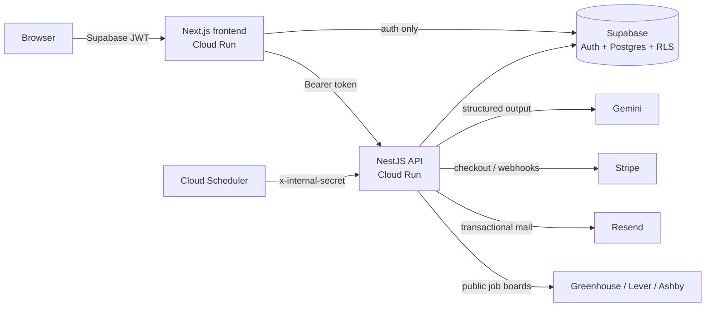

# SignalScout

**Turn public hiring data into qualified B2B pipeline.** SignalScout watches the job
boards of companies you care about, uses an LLM to decide which postings are genuine
buying signals for *your* product, explains why, and drafts a signal-specific outreach
email — all metered by a credit system with Stripe-powered upgrades.

It's a complete, production-shaped SaaS: typed end-to-end, authenticated, billed,
background-processed, tested, containerized, and deployable to Google Cloud Run.

---

## Highlights

- **AI with structured outputs** — Gemini evaluates each posting against a plain-English
  "signal hypothesis" and returns a schema-validated verdict (match, confidence, category,
  reasoning, likely need, suggested angle). A deterministic mock provider keeps local dev
  and CI key-free.
- **Pluggable ingestion** — Greenhouse / Lever / Ashby adapters behind one interface and a
  registry, so a new provider is a new file (Open/Closed). Uses free public job-board APIs.
- **Credits & billing** — atomic, race-safe credit debits in Postgres; monthly resets;
  Stripe Checkout + billing portal + signature-verified webhooks (test mode).
- **Background jobs** — a batched ingestion sweep runs on an in-process cron *or* via a
  secret-guarded internal endpoint (the serverless-friendly Cloud Scheduler pattern), then
  emails per-user digests.
- **Security-by-default** — global Supabase-JWT guard, full Row Level Security, secrets
  validated at boot, structured logging with redaction.

## Tech stack

| Layer | Choice |
|---|---|
| Language | TypeScript (strict) across the whole monorepo |
| Frontend | Next.js 16 (App Router) · React 19 · Tailwind CSS v4 · SWR |
| Backend | NestJS 11 (DI, modules, repositories) · Express 5 |
| Database / Auth | Supabase (PostgreSQL + Auth + RLS) |
| AI | Google Gemini (`@google/genai`) with structured outputs |
| Payments | Stripe (test mode) |
| Email | Resend |
| Validation | Zod 4 (shared contracts) |
| Tooling | npm workspaces · ESLint · Prettier · Jest · Playwright |
| Delivery | Docker (multi-stage) · GitHub Actions · Google Cloud Run |

## Architecture



The frontend uses Supabase only for the auth session; **all data flows through the NestJS
API** (service-role, with RLS as defense-in-depth). See
[docs/ARCHITECTURE.md](docs/ARCHITECTURE.md) for the full design and trade-offs.

## Monorepo layout

```
signalscout/
├── frontend/            # Next.js app (UI, auth, dashboard)
├── backend/             # NestJS API (feature modules + platform layer)
├── packages/shared/     # Zod contracts + types shared by both apps
├── supabase/            # SQL migrations + config
├── scripts/             # seed script
├── docs/                # architecture, database, API, deploy, env
└── .github/workflows/   # CI + deploy
```

## Quickstart (local)

> Prerequisites: Node 22+, a free [Supabase](https://supabase.com) project (or the Supabase
> CLI), and optionally a free [Gemini API key](https://aistudio.google.com/apikey).

```bash
npm install                          # installs all workspaces, builds shared contracts

# 1. Configure
cp backend/.env.example backend/.env            # fill in Supabase keys (Gemini/Stripe/Resend optional)
cp frontend/.env.local.example frontend/.env.local

# 2. Apply the database schema to your Supabase project
npx supabase db push        # or run supabase/migrations/*.sql in the SQL editor

# 3. (optional) Seed a demo account + sample signals
npm run db:seed

# 4. Run both apps
npm run dev                  # api on :8080, web on :3000
```

The API runs with `AI_PROVIDER=mock` by default — no Gemini key required to try it.
Full walkthrough: [docs/LOCAL_SETUP.md](docs/LOCAL_SETUP.md).

## Scripts

| Command | Description |
|---|---|
| `npm run dev` | Run backend + frontend together |
| `npm run build` | Build shared, backend, and frontend |
| `npm run lint` | Lint both apps |
| `npm run test -w backend` | Backend unit tests |
| `npm run test:e2e -w backend` | Backend e2e (health) |
| `npm run test:e2e -w frontend` | Playwright e2e |
| `npm run db:push` / `db:seed` | Apply migrations / seed demo data |

## Testing

- **Unit** — services and pure logic (auth guard, credit/AI pipeline, ingestion adapters).
- **Integration / e2e** — NestJS app boot + health probes (Jest + Supertest).
- **End-to-end** — Playwright drives the landing → signup flow in a real browser.

CI runs lint, typecheck, all tests, both production builds, and validates both Docker images
on every push.

## Documentation

- [Architecture & design decisions](docs/ARCHITECTURE.md)
- [Database schema & ER diagram](docs/DATABASE.md)
- [API reference](docs/API.md)
- [Local setup](docs/LOCAL_SETUP.md)
- [Deployment to Google Cloud Run](docs/DEPLOYMENT.md)
- [Environment variables](docs/ENVIRONMENT.md)

## License

MIT
