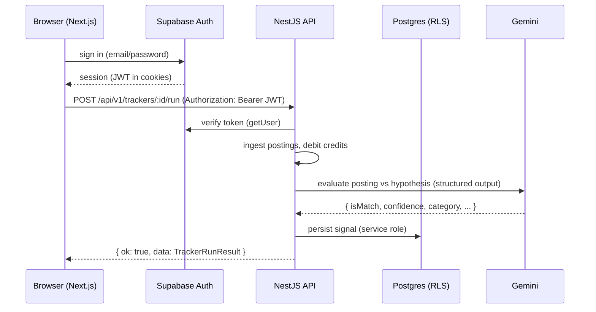

# Architecture

## Overview

SignalScout is an npm-workspaces monorepo with three packages:

- **`packages/shared`** — framework-agnostic domain contracts: Zod schemas + inferred
  TypeScript types (signals, trackers, plans, credits, billing, API envelope). It is the
  single source of truth consumed by both the API and the web app, so request/response
  shapes can never drift between client and server.
- **`backend`** — a NestJS API exposing a versioned REST surface.
- **`frontend`** — a Next.js (App Router) application.

## Request flow



The frontend uses Supabase **only** for the auth session. All application data is read and
written through the NestJS API, which authenticates the Supabase JWT and uses the
service-role key with explicit per-user scoping in every repository. Row Level Security is
enabled on every table as a second, independent line of defense.

## Backend layers

```
backend/src/
├── main.ts               # bootstrap: helmet, CORS, versioning, filters, swagger
├── config/               # Zod-validated env (fail-fast) + typed AppConfigService
├── common/               # cross-cutting: exception filter, response interceptor,
│                         #   Zod validation pipe, pino logger config, decorators
├── supabase/             # typed service-role client + JWT verification + DB health check
├── auth/                 # global SupabaseAuthGuard (+ @Public, @CurrentUser)
├── health/               # liveness / readiness probes
├── profiles/             # /me + welcome email claim
├── trackers/             # tracker CRUD (plan-limited)
├── ingestion/            # job-board adapters + registry + ingestion service
├── ai/                   # AiEvaluator interface, Gemini + Mock implementations, prompts
├── signals/              # the pipeline: ingest → debit → evaluate → persist; outreach
├── credits/              # credit account, ledger, atomic debit/grant
├── billing/              # Stripe checkout, portal, webhook
└── jobs/                 # ingestion sweep runner, cron, internal trigger endpoint
```

Each feature module follows the same shape: a **controller** (HTTP + validation), a
**service** (business logic), and a **repository** (data access, snake_case ↔ camelCase
mapping). Dependencies are injected; nothing reaches for a concrete client directly.

### Cross-cutting platform

- **Response envelope** — a global interceptor wraps every success in `{ ok: true, data }`;
  the exception filter emits `{ ok: false, error: { code, message, details? } }`. The
  frontend has exactly one contract to handle. Webhooks/probes opt out via `@RawResponse()`.
- **Validation** — a `ZodValidationPipe` validates request bodies/queries against the same
  shared schemas the frontend uses.
- **Config** — all environment variables are parsed once through a Zod schema at boot; a
  misconfiguration fails loudly immediately rather than at first use.
- **Logging** — `nestjs-pino` emits pretty logs in development and structured JSON
  (Cloud Logging-ready) in production, with auth headers redacted.

## Key design decisions & trade-offs

- **Dedicated NestJS backend (not Next.js route handlers).** Next.js could host the API, but
  a separate backend makes the service/repository layers, DI, and background processing
  first-class and independently deployable/scalable. Trade-off: two deploy targets.
- **Client-side data fetching with SWR.** The dashboard fetches from the API client-side
  (token attached from the Supabase session) rather than via RSC. This keeps one auth path,
  gives crisp loading/empty/error states, and makes optimistic mutations simple. Trade-off:
  less server rendering of dynamic data.
- **Service role + RLS, not per-request RLS clients.** The API holds the service-role key and
  scopes every query by `user_id`; RLS protects the public-facing path as defense-in-depth.
  This keeps queries simple and fast while staying safe.
- **Denormalized posting snapshot on `signals`.** Each signal stores the company/title/url it
  was derived from, so user-scoped reads never touch the shared `job_postings` table and need
  no cross-user RLS policy. Trade-off: a little duplication for simpler, faster, safer reads.
- **Credits enforced by an atomic SQL function, not a guard.** `debit_credits` does a
  conditional `UPDATE ... WHERE balance >= amount` so concurrent operations can never
  overspend — correctness lives in the database, at the point of mutation.
- **AI behind an interface with a deterministic mock.** `AI_PROVIDER=mock` runs the whole
  product with no API key (great for local/CI/tests); `gemini` swaps in real structured
  output. The domain depends on the `AiEvaluator` abstraction, not a vendor SDK.
- **Two ways to run the background sweep.** An in-process cron suits always-on/local; a
  secret-guarded `POST /api/internal/jobs/run-ingestion` suits serverless (Cloud Run scales
  to zero, so Cloud Scheduler triggers it). Same code path, guarded by an overlap lock.

## Frontend architecture

- **App Router** with a server-rendered auth gate (`dashboard/layout.tsx` + a `proxy.ts`
  edge check that redirects unauthenticated users and bounces authenticated users away from
  auth pages).
- **Design system first** — `globals.css` defines the token set (Tailwind v4 `@theme`); all
  components consume tokens, never hard-coded colors.
- **Typed API client** attaches the Supabase access token and unwraps the shared envelope,
  surfacing a typed `ApiError`. Feature pages compose primitives (`Button`, `Card`, `Field`,
  `Badge`, `Skeleton`, `EmptyState`) and domain components (`SignalRow`, `ConfidenceBar`).
