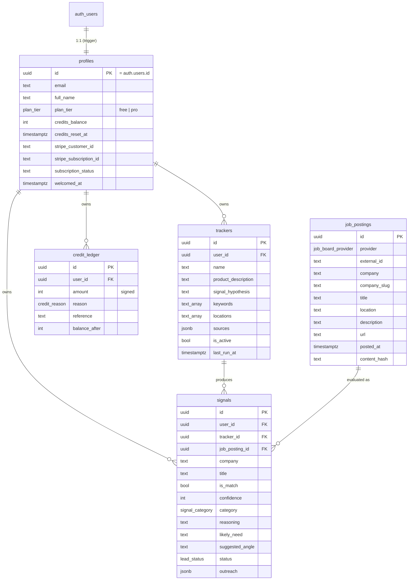

# Database

PostgreSQL, managed by Supabase. Schema lives in `supabase/migrations/` and is the source of
truth; the backend's `database.types.ts` mirrors it (in production it would be generated via
`supabase gen types typescript`).

## ER diagram

## Tables

| Table | Purpose |
|---|---|
| `profiles` | One row per auth user (created by a trigger on signup). Holds plan, credit balance, and Stripe linkage. |
| `trackers` | A user's ICP + signal hypothesis + the company job boards to watch. |
| `job_postings` | Internal, deduplicated cache of ingested postings (service-role only). |
| `signals` | One AI evaluation per `(tracker, posting)`, with a denormalized posting snapshot, status, and optional outreach. Matches are the user's "leads". |
| `credit_ledger` | Append-only audit trail of every credit movement. |

## Enums

`plan_tier`, `signal_category`, `lead_status`, `job_board_provider`, `credit_reason` — native
Postgres enums that mirror the `@signalscout/shared` contracts exactly.

## Functions (SECURITY DEFINER, service-role only)

- **`debit_credits(user, amount, reason, ref)`** — atomic spend via a conditional
  `UPDATE ... WHERE credits_balance >= amount`; raises `insufficient_credits` when short, so
  concurrent debits can never overspend. Writes a ledger entry.
- **`grant_credits(...)`** — atomic top-up (plan upgrade, refunds) + ledger entry.
- **`reset_credits_if_due(user, amount)`** — resets the balance to the plan allotment once the
  30-day window elapses; idempotent under concurrency.
- **`handle_new_user()`** — trigger on `auth.users` insert that creates the profile and a
  signup-bonus ledger entry.

These functions have `EXECUTE` revoked from `public` and granted only to `service_role`.

## Row Level Security

RLS is enabled on all tables:

- `profiles` — owner can `select`/`update` their row.
- `trackers` — owner has full CRUD.
- `signals` — owner can `select`/`update`/`delete`; inserts come from the service role.
- `credit_ledger` — owner read-only (writes only via the credit functions).
- `job_postings` — no policies for end users; only the service role touches it.
